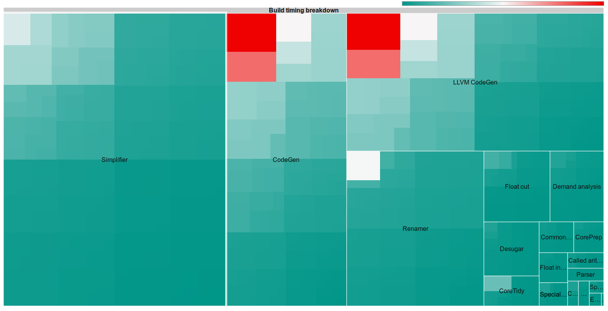

This tool can help visualize the results of fine-grained timing logs produced
by ghc when compiling in verbose mode (with `-v`). It processes the lines that
look like:

    !!! Liberate case [Data.Binary.Class]: finished in 32.06 milliseconds, allocated 14.879 megabytes
    !!! Simplifier [Data.Binary.Class]: finished in 873.97 milliseconds, allocated 563.867 megabytes
    ...etc

You can open `index.html` in your browser (hosted [here](https://jberryman.github.io/ghc-timing-treemap/)) 
and open a log file containing such records and it will parse and visualize the
results, producing a treemap plot like:

Compilation phases are grouped together and labeled with its area corresponding
to how much time was spent in that phase (e.g. here about a third of the time
was spent in the simplifier).

Within each group each sample is shaded to distinguish many short-running
samples from a few long-running runs. In the example we can see that the time
spent in the renamer/typechecker consisted of many fairly short operations,
while the CodeGen operations seem to have some bigger outliers.

So boxes in red mean it might be worthwhile to optimize for that particular case.
